# R2RI Dataset

We are creating a dataset of robots interacting with each other. 

## Install environment


```
conda env create -f environment.yml
```
then 

```
conda activate Robots
```


## Generating Videos and Data


Download SMPL-X models here: https://drive.google.com/file/d/1eF2DCk7GhbSAYfC8eKVFCU27P4VeKNPV/view?usp=sharing

Put the models_smplx_v1_1 in the main folder.

Download the Inter-X dataset https://github.com/liangxuy/Inter-X, and extract the motion folder wherever you want. That will be your PATH_TO_INTERACTION.


Retargeting pose from human to robot:

```
python retarget_motion.py --interaction PATH_TO_INTERACTION --robot ROBOT_NAME
```

If you want only one pose run:

```
python retarget_pose.py --interaction PATH_TO_INTERACTION --robot ROBOT_NAME
```

This will save robot configurations in the same folder.


To extract data like poses and collisions run:

```
python compute_data.py --interaction PATH_TO_INTERACTION --robot1 ROBOT1_NAME --robot2 ROBOT2_NAME
```

To create videos 

```
python render.py --robot1 ROBOT1 --robot2 ROBOT2 --interaction PATH_TO_INTERACTION --scene SCENE --video PATH_TO_VIDEO --camera_mode CAMERA MODE
```


Alternatively you can use ./compute_data.sh $INTERACTION $SCENE $ROBOT, to do it all at once.


## Organization of sample data


```
R2RI_dataset/
├── G020T004A024R021/
│   ├── g1/
│   │   ├── exoL/
|   |   |     ├── frame_00000.png
|   |   |     ├── frame_00001.png
|   |   |     ...
|   |   ├── exoR/
|   |   ├── ego1L/
|   |   ├── ego1R/
|   |   ├── ego2L/
|   |   ├── ego2R/
│   │   └── data/
│   │       ├── g1_data_1.pkl
│   │       ├── g1_data_2.pkl
│   │       ├── g1_cameras.pkl
│   │       └── g1_g1_collisions.pkl
│   │
│   └── nao/
|   |    ├── exoR/
|   ...  ├── ego1L/
|        ├── ego1R/
|        ├── ego2L/
|        ├── ego2R/
│        └── data/
│           ├── nao_1_data.pkl
│           ├── nao_2_data.pkl
│           ├── nao_cameras.pkl
│           └── nao_nao_collisions.pkl
│
├── G022T009A032R010
├── G024T004A020R004
└── ...
```


Each file `data_{num}_{robot}.pkl` contains a Python dictionary with the following top-level structure:

```
dict_keys(['exoR', 'world', 'ego2R', 'exoL', 'ego1L', 'ego2L', 'ego1R'])
```

world contains only the 3D pose (pose3D) in the global coordinate system.

All other views (exoR, exoL, ego1R, ego2R, ego1L, ego2L) include:

```
dict_keys(['pose2D_total', 'pose2D', 'pose3D_total', 'pose3D', 'camera_params', 'bb2D'])
```

`pose3D_total` and `pose2D_total` contain the poses of all links or entities visible in the scene.
The number of joints may vary between robots, depending on their kinematic structure.

`pose3D` and `pose2D` contain the pose of the main robot, represented with a consistent joint hierarchy across all samples.

| Joint Index | Joint Name     |
|--------------|----------------|
| 0 | Torso |
| 1 | Neck |
| 2 | Left Hip |
| 3 | Left Knee |
| 4 | Left Ankle |
| 5 | Left Shoulder |
| 6 | Left Elbow |
| 7 | Left Wrist |
| 8 | Right Hip |
| 9 | Right Knee |
| 10 | Right Ankle |
| 11 | Right Shoulder |
| 12 | Right Elbow |
| 13 | Right Wrist |


`bb2D` contains the bounding box of the robot in the current file.
Note that in egocentric (Ego) views, the first-person robot is not visible, so its bounding box is not included.

For example:

In ego1R, the robot holding the camera is not visible, so 'bb2D' is not present in data_1_{robot}.pkl.
In data_2_{robot}.pkl, which corresponds to the other robot, 'bb2D' is included.

FINAL NOTE: If you can't load the data with pickle, i suggest to:
  
  ```
  pip install joblib
  ```


## Sample of interaction:

<table align="center">
  <tr>
    <td align="center" colspan="3">
      <h3>NAO — PULL</h3>
    </td>
  </tr>
  <tr>
    <td align="center">
      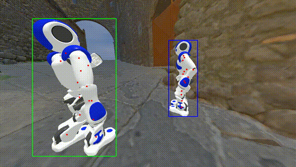<br>
      <sub>Exo Camera</sub>
    </td>
    <td align="center">
      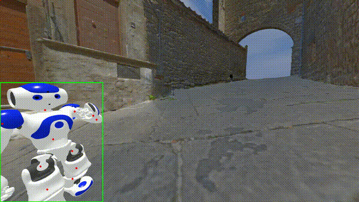<br>
      <sub>Ego Camera 1 R</sub>
    </td>
    <td align="center">
      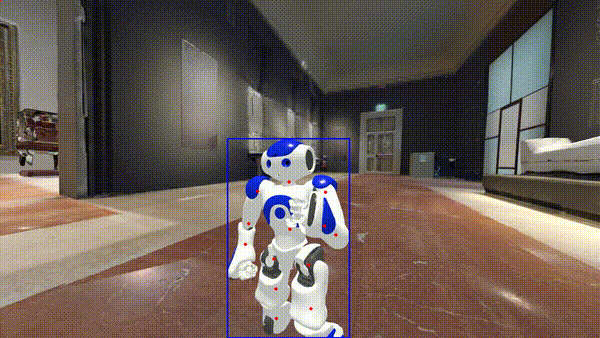<br>
      <sub>Ego Camera 2 R</sub>
    </td>
  </tr>
</table>


<table align="center">
  <tr>
    <td align="center" colspan="3">
      <h3>G1 — KICK</h3>
    </td>
  </tr>
  <tr>
    <td align="center">
      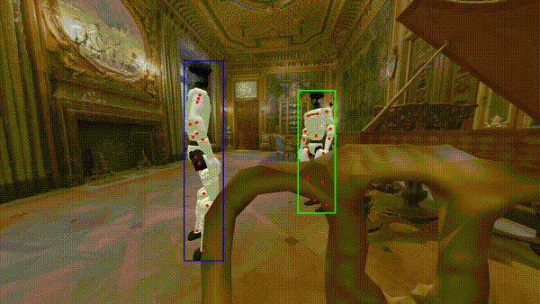<br>
      <sub>Exo Camera</sub>
    </td>
    <td align="center">
      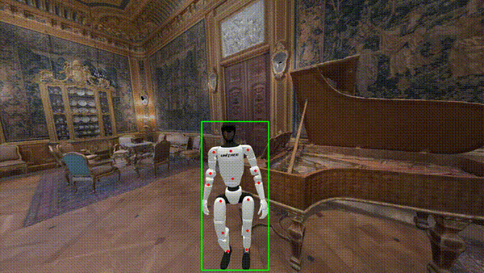<br>
      <sub>Ego Camera 1 R</sub>
    </td>
    <td align="center">
      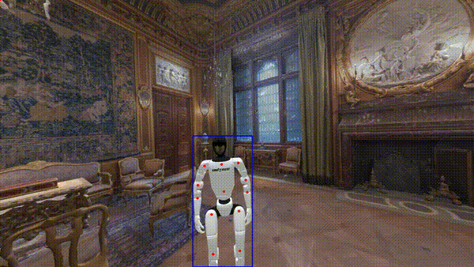<br>
      <sub>Ego Camera 2 R</sub>
    </td>
  </tr>
</table>

<table align="center">
  <tr>
    <td align="center" colspan="3">
      <h3>ICUB — HUG</h3>
    </td>
  </tr>
  <tr>
    <td align="center">
      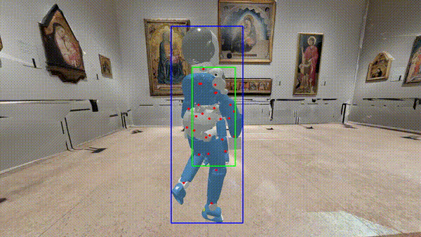<br>
      <sub>Exo Camera</sub>
    </td>
    <td align="center">
      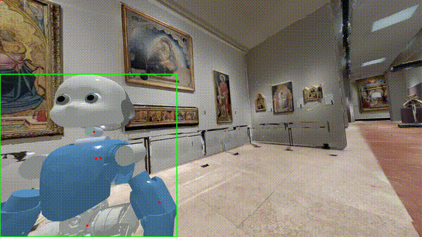<br>
      <sub>Ego Camera 1 R</sub>
    </td>
    <td align="center">
      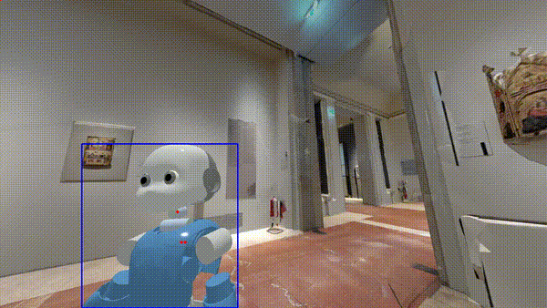<br>
      <sub>Ego Camera 2 R</sub>
    </td>
  </tr>
</table>

<table align="center">
  <tr>
    <td align="center" colspan="3">
      <h3>PEPPER — LINK ARMS</h3>
    </td>
  </tr>
  <tr>
    <td align="center">
      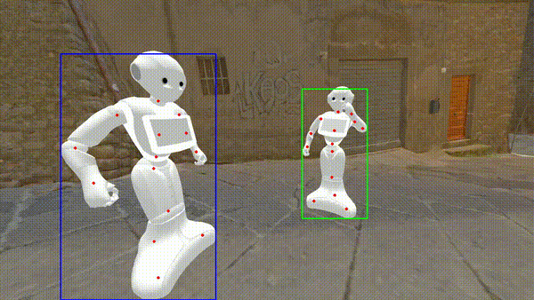<br>
      <sub>Exo Camera</sub>
    </td>
    <td align="center">
      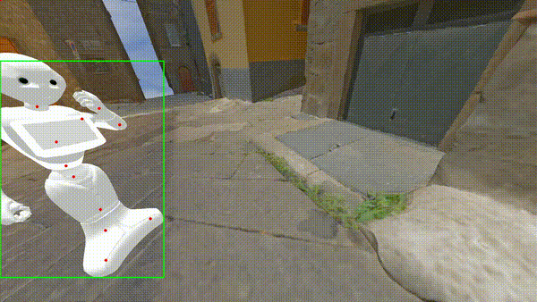<br>
      <sub>Ego Camera 1 R</sub>
    </td>
    <td align="center">
      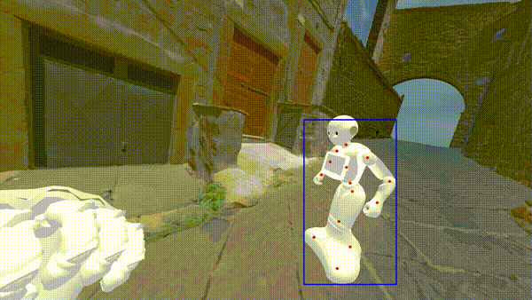<br>
      <sub>Ego Camera 2 R</sub>
    </td>
  </tr>
</table>

<table align="center">
  <tr>
    <td align="center" colspan="3">
      <h3>ATLAS — TOUCH FACE</h3>
    </td>
  </tr>
  <tr>
    <td align="center">
      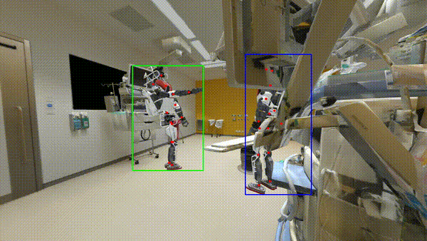<br>
      <sub>Exo Camera</sub>
    </td>
    <td align="center">
      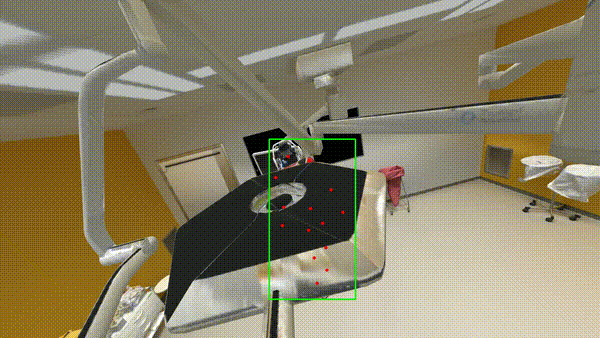<br>
      <sub>Ego Camera 1 R</sub>
    </td>
    <td align="center">
      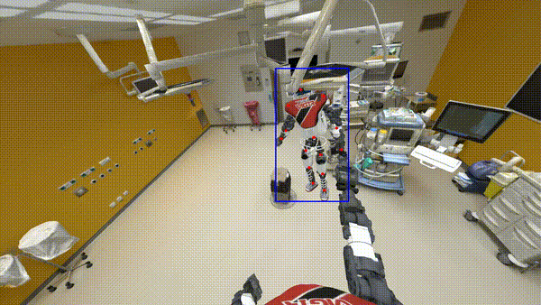<br>
      <sub>Ego Camera 2 R</sub>
    </td>
  </tr>
</table>

